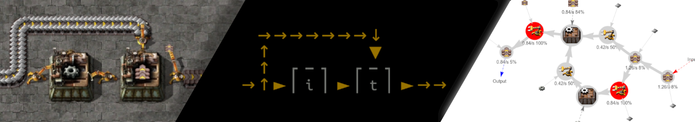
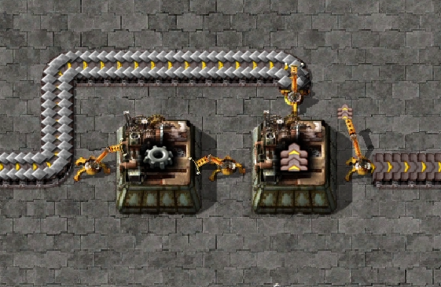
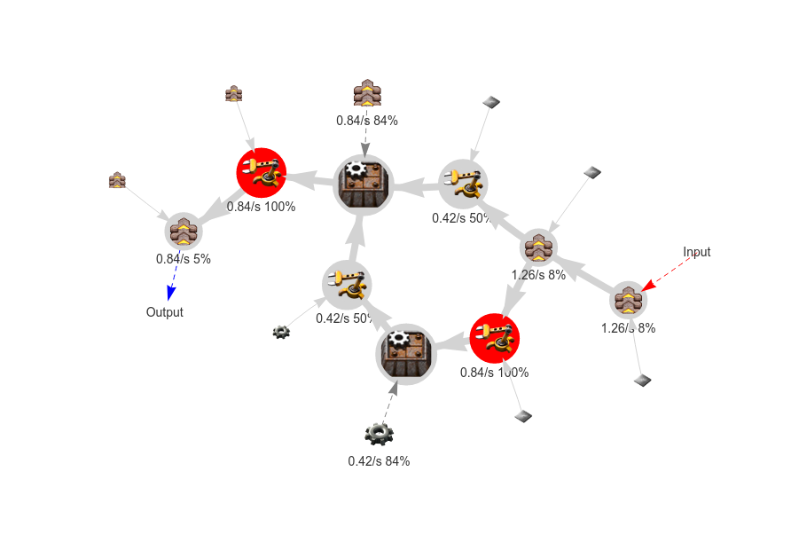

# Factorio blueprint bottle-neck analysis tool



# What is this tool?

This is a Python script that finds the bottleneck of a Factorio blueprint for you.

It also predicts:
- Which entities are the input or the output of the blueprint
- What items each belts, inserters or any entities are excpected to transport
- The excepted items/s that will be tranported by each entity
- The excepted usage percentage of each entity

## What is a bottleneck?

A bottleneck is, in a Factorio blueprint, the entity that limits the output of a production line because it is at maximum capacity. It can be a belt, an inserter or a assembly machine. It's the entity that you need to improve to have a more efficient production line.

## In what way is this tool useful?

You can do what you want with the results of this tool, it can help programmers:
- Create blueprints with machine learning
- Create blueprints with evolutionary algorithms
- Create a dataset of efficient blueprints

You can use this tool to find bottlenecks in your blueprints without having to run them in the game, or you can use the algorithm to create a mod that will display the in-game bottleneck!

# Usage

We will use the blueprint [examples/beltFac.json](./examples/beltFac.json) of the following production line:


```bash
# If you haven't done it, init the project
git clone https://github.com/Tomansion/factorio_blueprint_analyser
cd factorio_blueprint_analyser
pip install -r requirements.txt

# Start the algorithm:
./blueprint_analyser -f -i examples/beltFac.json
```

This should open a web browser with the results of the analysis as a graphical node graph, and a `analysed_blueprint.json` file containing the results of the analysis should be created.

For a complete usage guide, see the [use guide](./doc/use_guide.md)!

## Graph output

The graph result should be:



We can see that the input and the output has been clearly identified.

The small icon linked to each nodes is the item that the algorithm is expecting to be transported by the entity, for example, the transport belt ouput node is transporting the item `transport-belt`.

## Terminal output

In the terminal, you should see first a representation of the blueprint:

```
      → → → → → → → ↓
      ↑             ▼
      ↑   ┌ ─ ┐   ┌ ─ ┐
    → ↑ ► │ i │ ► │ t │ ► → →
```

Then after some other logs, the expected produced items:

```
Bottleneck calculation complete!
Produced items:
   transport-belt: 0.84 /s
```

## How does it work?

1. First, the algorithm create a 2D map of the blueprint, try to understand the link between each entities and create a node network.
2. Then, it tries to estimate what items are expected to be transported by each entity according to the assembly machines recipes.
3. Finally, it estimates the expected usage of each entity with a flow simulation according to the entities capacity, recipe time and assembly machines speed.

The algorithm expect the material input belts to be at maximum capacity with the items they are supposed to transport.

## Known issues

Most of the blueprints gives good results, but certain blueprints still give bad results ([#1](https://github.com/Tomansion/factorio_blueprint_analyser/issues/1)).

Running the analysis many time taks more and more time ([#2](https://github.com/Tomansion/factorio_blueprint_analyser/issues/2))

This algorithm can only process with the latest Factorio blueprint versions ([#2](https://github.com/Tomansion/factorio_blueprint_analyser/issues/3))

## Limitations and Next steps
    ☐ Furnaces (no combustion items)
    ☐ Science
    ☐ Better unsuported items display
    ☐ Filters
    ☐ Beacons
    ☐ Modules
    ☐ Multy system process

## Next projects
    ☐ Blueprint analysis dashboard
    ☐ creation of the belt factory with genetic algorithm

## Contribution

Coming soon

## Credits

This tool is the result of an internship at the [Michigan State University](https://msu.edu/) and was made in collaboration with the **The Factory Must Grow: Automation in Factorio** team. You can find their first paper [here](https://arxiv.org/abs/2102.04871).

Thanks to [DrKenReid](https://github.com/DrKenReid) and the whole **The Factory Must Grow** team for the amaizing welcoming and for giving me the oportunity to have this wondeful experience!


Factorio blueprint decode and encode code from : https://gist.github.com/click0/46b0ff88361956e430bfcf1e88b5c351

Factorio vanilla data imported from : https://jackhugh.github.io/factorio-data-raw-visualiser/data-raw.json
